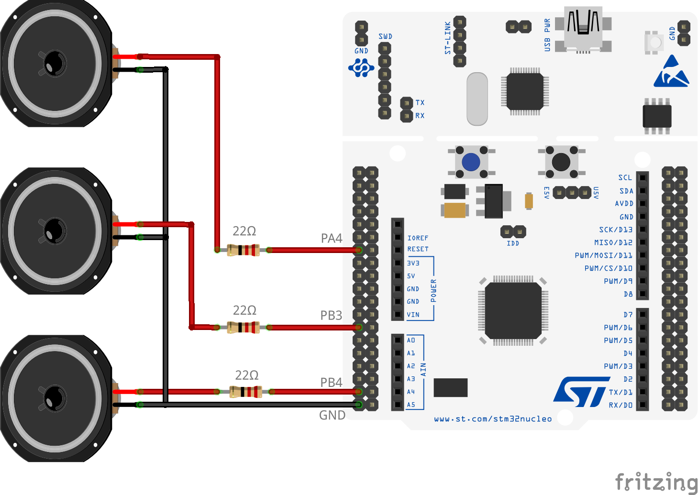
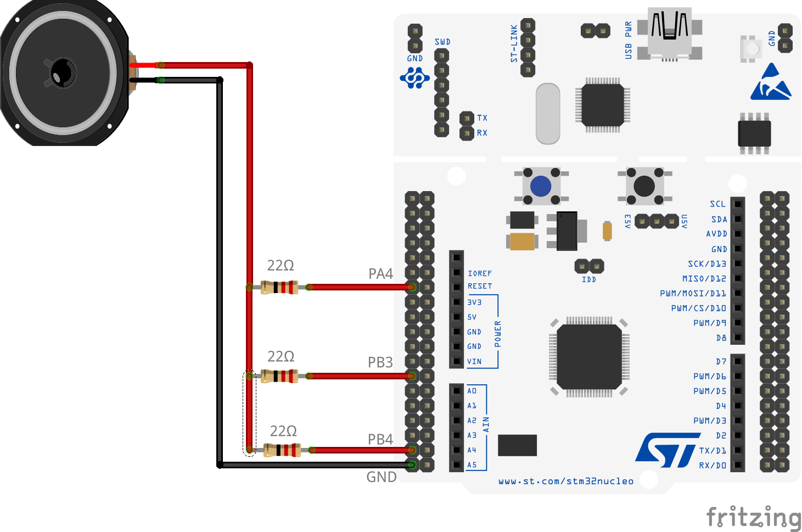

# STM32 PWM Music Module

This repository is used to create PWM audio signals on STM32 MCUs with Low Layer (LL) Library. This implementation is based on a STM32F07B-DISCO board using STM32CubeIDE (Version: 1.10.1) and CubeMX to initialize peripherals.
The speaker and music module can be easily moved to any other STM32 implementation.

This implementation uses 3 PWM outputs to create up to 3 different audio signals at the same time. But it's possible to initialize even more PWM outputs, as long as Timers with Capture and Compare PWM Output Channels are available on the MCU. FreeRTOS is used for an easy implementation of playing different soundtracks at the same time, even if this implementation is not thread safe.

Implemented songs:
- Zelda Overworld Soundtrack
- Tetris + Tetris Ragtime Edition
- ACDC - Thunderstruck Intro
- Super Mario Bros. (just frist few notes)
- alarm sound (with frequency sweeping)

## Circuit Diagram
Single speaker for each PWM output:

You can also just combine the PWM outputs to drive a single speaker (see also [here](http://www.openmusiclabs.com/learning/digital/pwm-dac/dual-pwm-circuits/index.html) for combining multiple PWM outputs):

Important: The used pins does not met the real pin positions an a STM32 Nucleo board.